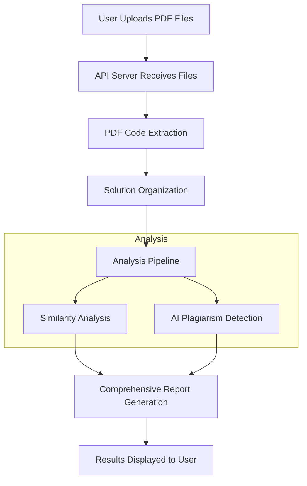

# Warden+

A comprehensive plagiarism detection system for programming assignments that analyzes student code submissions through multi-faceted verification.


## Overview

Warden+ is a powerful tool designed to detect plagiarism in student code submissions by employing a two-pronged analysis approach:

1. **Student-to-Student Similarity Detection**: Compares code submissions to identify potential copying among students
2. **AI-Generated Code Detection**: Analyzes code for patterns indicative of AI-generated content

The system processes PDF assignments, extracts code solutions, and provides detailed reports through an intuitive web interface.

## Features

- **PDF Code Extraction**: Automatically extracts code from PDF submissions with intelligent solution boundary detection
- **Multiple Analysis Methods**: Combines token-based, AST-based, and semantic similarity analysis
- **AI Detection**: Identifies hallmarks of AI-generated code through feature analysis
- **Comprehensive Reporting**: Presents analysis results in an easy-to-understand format
- **Interactive Visualization**: Compare suspicious code sections side-by-side
- **Batch Processing**: Analyze multiple student submissions at once
- **Session Management**: Track analysis sessions with unique identifiers

## System Architecture

```
├── Frontend/                 # User interface
│   ├── index.html            # File upload interface
│   ├── results.html          # Results visualization
│   ├── css/                  # Stylesheets
│   └── js/                   # JavaScript files
│
├── Processing/               # Backend components
│   ├── code_extraction/      # PDF code extraction
│   ├── similarity_analysis/  # Student-to-student comparison
│   ├── AI_plagarism_detector/# AI-generated code detection
│   └── core_backend/         # Main processing & API server
│
└── sample_pdfs/              # Sample PDF files for testing
```

## System Workflow



## Installation

### Prerequisites

- Python 3.8 or higher
- Web browser with JavaScript enabled

### Setup

1. Clone the repository:
   ```bash
   git clone https://github.com/yourusername/warden-plus.git
   cd warden-plus
   ```

2. Create and activate a virtual environment:
   ```bash
   python -m venv venv
   source venv/bin/activate  # On Windows, use: venv\Scripts\activate
   ```

3. Install dependencies:
   ```bash
   pip install flask flask-cors pdfplumber numpy scikit-learn python-Levenshtein werkzeug requests nltk
   ```

4. Download NLTK data:
   ```bash
   python -c "import nltk; nltk.download('punkt'); nltk.download('stopwords')"
   ```

## Usage

1. Start the server:
   ```bash
   cd Processing/core_backend
   python api_server.py
   ```

2. Access the web interface at [http://localhost:5000](http://localhost:5000)

3. Upload PDF files containing student code submissions

4. View and analyze the plagiarism detection results

## Key Components

### PDF Code Extraction

The system extracts code from PDF files using pdfplumber and employs sophisticated algorithms to:
- Detect solution boundaries
- Identify code blocks (functions, classes, main methods)
- Group related code into complete solutions
- Clean and format extracted code

### Similarity Analysis

Multiple similarity detection methods are used:
- Token-based comparison with TF-IDF vectorization
- Abstract Syntax Tree (AST) structural analysis
- Control flow pattern matching

### AI-Generated Code Detection

The AI detector analyzes:
- Code complexity patterns
- Comment style and distribution
- Variable naming conventions
- Error handling implementations
- Structural characteristics
- Language idiomaticity

## Customization

### Adding Support for New Languages

To add a new programming language:

1. Update the extraction patterns in `complete_solution_extractor.py`
2. Add language-specific stop words in the similarity analyzer
3. Implement or adapt the AST parser for the new language

### Adjusting Detection Thresholds

Configure sensitivity thresholds in `config.json`:
```json
{
  "similarity_threshold": 0.7,
  "ai_detection_threshold": 0.65
}
```

## Troubleshooting

### Common Issues

#### PDF Extraction Issues
- Ensure PDFs contain extractable text (not scanned images)
- Check for unusual formatting in the PDF
- Verify the solution boundary detection is working correctly

#### Server Connection Problems
- Confirm the server is running (check terminal output)
- Verify port 5000 is not in use by another application
- Check for firewall or network restrictions

#### Analysis Pipeline Errors
- Ensure all required dependencies are installed
- Check permissions on output directories

## License

This project is licensed under the MIT License - see the LICENSE file for details.

## Acknowledgments

- Flask for the web server framework
- pdfplumber for PDF text extraction
- scikit-learn for machine learning algorithms
- NLTK for natural language processing
